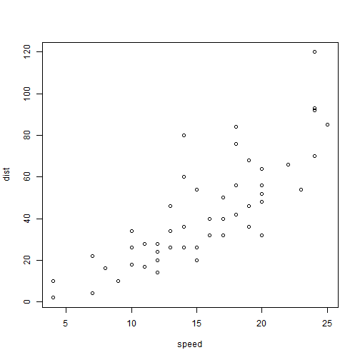

rpres-test
========================================================
transition: rotate
author: Matthieu Guérin
date: ```r date() ```

First Slide
========================================================
transition: rotate

For more details on authoring R presentations click the
**Help** button on the toolbar.

- Bullet 1
- Bullet 2
- Bullet 3

Slide With Code
========================================================
transition: rotate


```r
summary(cars)
```

```
     speed           dist    
 Min.   : 4.0   Min.   :  2  
 1st Qu.:12.0   1st Qu.: 26  
 Median :15.0   Median : 36  
 Mean   :15.4   Mean   : 43  
 3rd Qu.:19.0   3rd Qu.: 56  
 Max.   :25.0   Max.   :120  
```

Slide With Plot
========================================================
transition: rotate

 

***

second column
